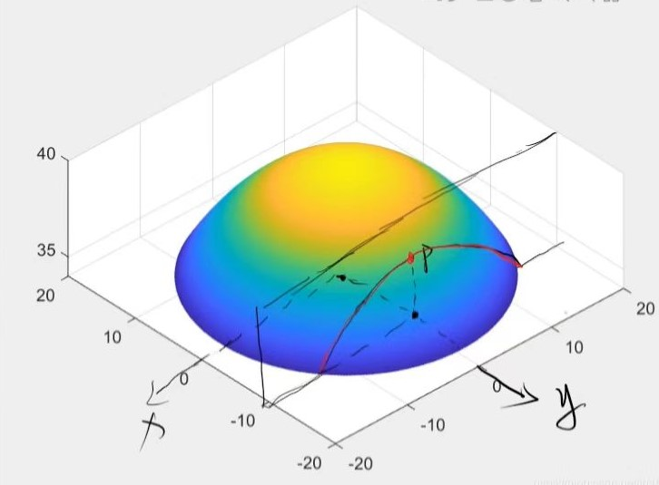

# 梯度下降算法

## 偏导数

由$xy$平面中平行于$x$轴或者$y$轴的直线决定的曲线。假设有一个二元函数 $z=f(x,y)$，那么它对$x$的偏导即为$\frac{\partial z}{\partial x} = \lim_{\Delta x \to 0} \frac{f(x + \Delta x , y) - f(x, y)}{\Delta x}$，如下图

$z$对$x$求偏导， $y$没有变化。偏导数就是这根曲线的切线的斜率。

## 方向导数

偏导数只能解决一个方向上($x$轴或$y$轴)的变化，如果$x$和$y$同时变化，则需要求方向导数。由方向向量来表示截面方向($0 \sim 180^°$)，方向向量用单位向量表示，即$\boldsymbol{i} = (cos\alpha, sin\alpha)$，在$\Delta x$和$\Delta y$都很小时，有$\lim\limits_{\Delta x \rightarrow 0 \atop \Delta y \rightarrow 0} \frac{f(x + \Delta x,y + \Delta y) - f(x,y)}{\sqrt[]{(\Delta x)^2 + (\Delta y)^2}} \overset{\Delta x = cos\alpha \atop \Delta y = sin\alpha}{\Longrightarrow} \lim\limits_{t \rightarrow 0} \frac{f(x + tcos\alpha, y+tsin\alpha) - f(x,y)}{t} $ 

## 梯度

梯度基本定义：$\nabla f/grad f = \frac{\partial f}{\partial x} \cdot \boldsymbol{i} + \frac{\partial f}{\partial y} \cdot \boldsymbol{j}$。函数可微，有$\Delta z = \Delta x \cdot f_x(x,y) + \Delta y \cdot f_y(x,y) + O()$,忽略高阶无穷小，有$\Delta z = tcos\alpha \cdot f_x(x,y) + tsin\alpha \cdot f_y(x,y) = \nabla f(x,y) \cdot (tcos\alpha,tsin\alpha) \Rightarrow \lim\limits_{t \rightarrow 0} \frac{\Delta z}{t} = \nabla f(x,y) \cdot (cos\alpha,sin\alpha) $,这里的$\lim\limits_{t \rightarrow 0} \frac{\Delta z}{t}$就是方向导数，结果就是$\nabla f(x,y) \cdot \boldsymbol{u}  = |\nabla f(x,y)| \cdot cos\theta$,所以方向导数就是梯度模*夹角余弦，即梯度反映方向导数的最大值

## 参考链接

[梯度下降算法-梯度介绍](https://www.bilibili.com/video/BV1uP411572u/?spm_id_from=333.999.0.0&vd_source=dcf112f2615a3a392c3d19adbdc40193)

[如何直观形象地理解方向导数与梯度以及它们之间的关系](https://www.zhihu.com/question/36301367/answer/156102040)

